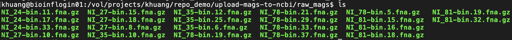
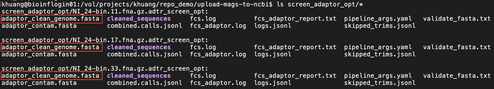
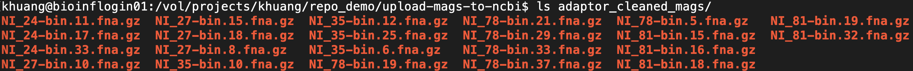

# upload-mags-to-ncbi
This repo is a demonstration for depositing MAGs (metagenome-assembled genomes) in NCBI.
Note: The whole tutorial is mainly for users on HZI slurm HPC infrastructure. For other users, certain degree of customization is needed.

## Table of Contents

1. [Submission preparation](#Preparation)
2. [MAG submission through NCBI portal](#Submission)


## Preparation

1. **Organize MAGs locally** <br> 
   Move the target MAGs to a specified folder. For example, we put 22 HQ MAGs in the folder:
   `/vol/projects/khuang/repo_demo/upload-mags-to-ncbi/raw_mags`

   <div style="margin-top: 15px;"></div>

   
   <div style="margin-bottom: 15px;"></div>
   
2. Screen adaptor with FCS tool
   We implemented FCS [(Foreign Contamination Screening) pipeline](https://github.com/ncbi/fcs) in our wrap-up script `fcs_launcher.sh` to ensure MAG quality for NCBI submission. In this step, we are using `screen_adaptor` module of `fcs_launcher.sh`:
   ```bash
   Usage: fcs_launcher.sh screen_adaptor -mags_dir [mags_folder_abspath] -opt_dir [output_folder_abspath]
   Options:

   -mags_dir    STR        Specify the absolute path of the folder containing target MAGs.
   -opt_dir     STR        Specify the absolute path of the folder to hold outputs.
   -mem         INT        Specify the memory in need (default = 12, Gb)
   -cpu         INT        Specify the number CPUs to use for processing one sample (default = 5)
   -log_dir     STR        Specify the directory to hold logs (default = /vol/cluster-data/khuang/slurm_logs)
   -time        INT        Specify the walltime (default = 24, hours)

   --help | -h             Show this help page

   !NOTE!: All inputs (including files and directories) should be given with an absolute path!
   ```

   The running command:

   ```bash
   fcs_launcher.sh screen_adaptor \
                   -mags_dir /vol/projects/khuang/repo_demo/upload-mags-to-ncbi/raw_mags \
                   -opt_dir /vol/projects/khuang/repo_demo/upload-mags-to-ncbi/screen_adaptor_opt \
                   -mem 12 -cpu 4 \
                   -log_dir /vol/projects/khuang/repo_demo/upload-mags-to-ncbi/logs2
   ```
   
   As results, in the output directory you will find each input raw MAG corresponds to one sub-directory with suffix `adtr_screen_opt`. And the MAG with adaptors being screened and cleaned is saved in `adaptor_clean_genome.fasta`. The clean genome file will be further used in the step of screening and cleaning foreign contamination. 

   Let's have a look at what outputs you shall expect from `fcs_launcher.sh screen_adaptor` module:
   <div style="margin-top: 15px;"></div>

   
   <div style="margin-bottom: 15px;"></div>

   Now we can create a new folder `adaptor_cleaned_mags`, and move and rename (using the names of raw MAGs) the adaptor-cleaned MAGs:

   <div style="margin-top: 15px;"></div>

   
   <div style="margin-bottom: 15px;"></div>  

3. Assign NCBI taxonomy to each MAG

3. NCBI foreign contamination screening with FCS tool


## Submission

