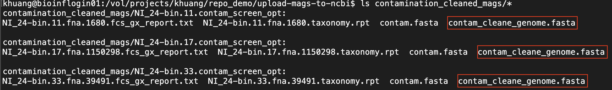
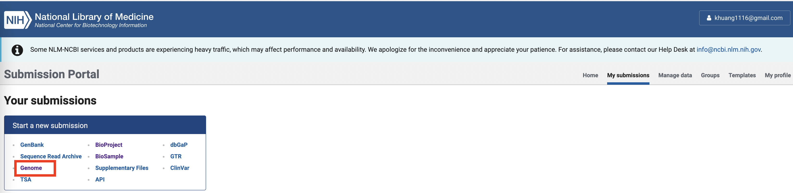
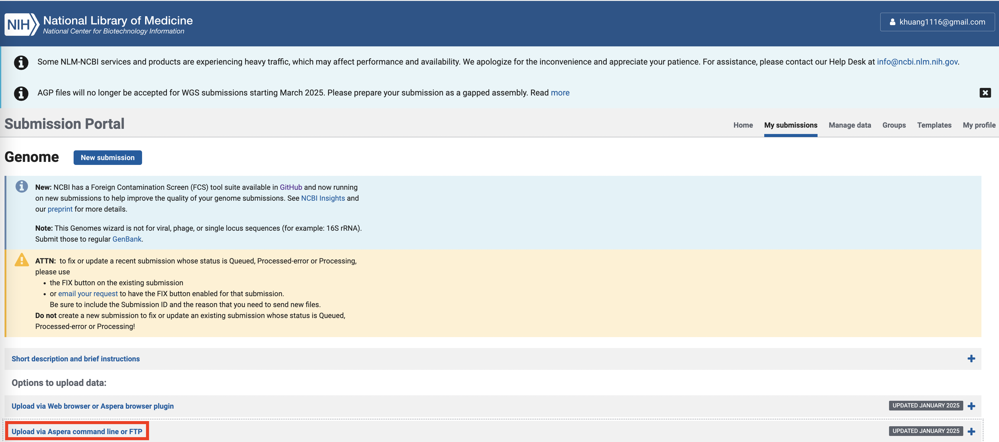
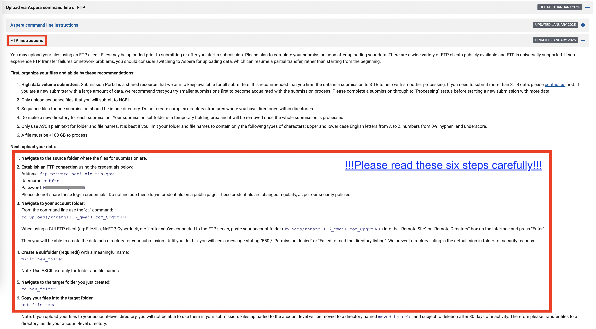

# Upload MAGs to NCBI

This repository provides a demonstration for depositing metagenome-assembled genomes (MAGs) into NCBI.  
**Note:** This tutorial primarily targets users on the HZI Slurm HPC infrastructure. For other environments, customization may be required.

---
## Table of Contents

1. [Submission Preparation](#submission-preparation)
2. [MAG Submission through NCBI Portal](#mag-submission-through-ncbi-portal)

---

## Submission Preparation

### 1. Organize MAGs Locally  
Move the target MAGs into a specified folder. For example, we placed 22 high-quality (HQ) MAGs in the following directory:  
`/vol/projects/khuang/repo_demo/upload-mags-to-ncbi/raw_mags`  


Directory structure example:  
<div style="margin-top: 15px;"></div>


<div style="margin-bottom: 15px;"></div>

---

### 2. Screen Adapters with the FCS Tool  

We use the **FCS (Foreign Contamination Screening) pipeline** [GitHub link](https://github.com/ncbi/fcs) via our wrapper script `fcs_launcher.sh` to ensure MAG quality. This step uses the `screen_adaptor` module of the script.  

**Usage**:  

```bash
fcs_launcher.sh screen_adaptor -mags_dir [mags_folder_abspath] -opt_dir [output_folder_abspath]
Options:
-mags_dir    STR  Absolute path to the folder containing MAGs.
-opt_dir     STR  Absolute path to the output folder.
-mem         INT  Memory allocation (default: 12 GB).
-cpu         INT  CPUs per sample (default: 5).
-log_dir     STR  Path for logs (default: /vol/cluster-data/khuang/slurm_logs).
-time        INT  Walltime in hours (default: 24).

--help | -h       Display this help page.

**Note:** All paths must be absolute!
```   


Example Command:

```bash
fcs_launcher.sh screen_adaptor \
                   -mags_dir /vol/projects/khuang/repo_demo/upload-mags-to-ncbi/raw_mags \
                   -opt_dir /vol/projects/khuang/repo_demo/upload-mags-to-ncbi/screen_adaptor_opt \
                   -mem 12 -cpu 4 \
                   -log_dir /vol/projects/khuang/repo_demo/upload-mags-to-ncbi/logs2
```

Output: Each raw MAG will generate a corresponding sub-directory with the suffix `_adtr_screen_opt`. The cleaned genome file is saved as `adaptor_clean_genome.fasta` and will be used in subsequent steps.

Directory structure example:

<div style="margin-top: 15px;"></div>


<div style="margin-bottom: 15px;"></div>

Organize Outputs:
1. Create a folder named `adaptor_cleaned_mags`.
2. Move and rename cleaned MAGs using the original raw MAG names.
Example:

<div style="margin-top: 15px;"></div>


<div style="margin-bottom: 15px;"></div>  

### 3. Screen Foreign Contaminats with FCS Tool <br>
The `fcs_launcher.sh` script also includes the `screen_contamination` module to screen and clean foreign contaminants from MAGs.

**Usage**:

```bash
fcs_launcher.sh screen_contamination -mags_ncbi_tax [mags_ncbi_taxonomy_file.tsv] -opt_dir [output_folder_abspath]
Options:
-mags_ncbi_tax    STR  Path to a TSV file containing MAG ID, location, NCBI taxonomy, and taxonomy ID.
-opt_dir          STR  Path to the output folder.
-mem              INT  Memory allocation (default: 512 GB).
-cpu              INT  CPUs per sample (default: 20).
-log_dir          STR  Path for logs (default: /vol/cluster-data/khuang/slurm_logs).
-time             INT  Walltime in hours (default: 12).

--help | -h       Display this help page.

**Note:** All paths must be absolute!
```

**Prepare NCBI Taxonomy Data**:

Assign [NCBI taxonomy ID](https://www.ncbi.nlm.nih.gov/taxonomy) to each MAG. Example input file:
[mags_ncbi_taxonomy.tsv](./demo_data/mags_ncbi_taxonomy.tsv)

**Important**: Use MAGs from the output of the `screen_adaptor` step, located in `adaptor_cleaned_mags`.

Example Command:


```bash
fcs_launcher.sh screen_contamination \
                   -mags_ncbi_tax /vol/projects/khuang/repo_demo/upload-mags-to-ncbi/mags_ncbi_taxonomy.tsv \
                   -opt_dir /vol/projects/khuang/repo_demo/upload-mags-to-ncbi/contamination_cleaned_mags \
                   -log_dir /vol/projects/khuang/repo_demo/upload-mags-to-ncbi/logs2
```

Output: Each MAG generates a corresponding sub-directory with the suffix `_contam_screen_opt`. The cleaned genome file is saved as `contam_clean_genome.fasta` and is now ready for NCBI submission.

Directory structure example:

<div style="margin-top: 15px;"></div>


<div style="margin-bottom: 15px;"></div> 


**Note**: Ensure filenames are modified to match unique MAG IDs before submission.

We can organize all cleaned MAGs in one folder and rename them using original raw MAG names (for example, `/vol/projects/khuang/repo_demo/upload-mags-to-ncbi/final_mags`). Now we can start submission procedure.  

## MAG Submission through NCBI Portal

To submit MAGs to NCBI, first we need to log into [NCBI submission portal](https://submit.ncbi.nlm.nih.gov/). Afterwards, click __My submission__ (please visit our tutorial for [uploading metagenomes to NCBI](https://github.com/KunDHuang/upload-metagenomes-to-ncbi) to refresh basics), and in __Your submissions__ please choose __Genome__:

<div style="margin-top: 15px;"></div>


<div style="margin-bottom: 15px;"></div> 

We first need to upload our MAGs to NCBI using FTP client - click __Upload via Aspera command line or FTP__:

<div style="margin-top: 15px;"></div>


<div style="margin-bottom: 15px;"></div> 


Next, please click __FTP instructions__ and read six steps below carefully:

<div style="margin-top: 15px;"></div>


<div style="margin-bottom: 15px;"></div> 

